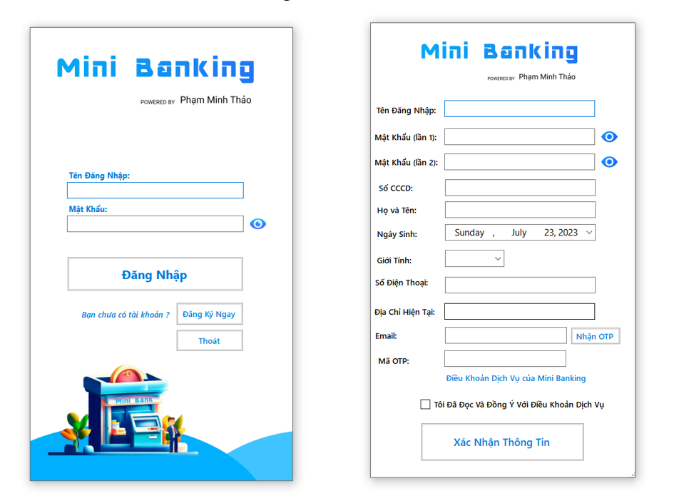
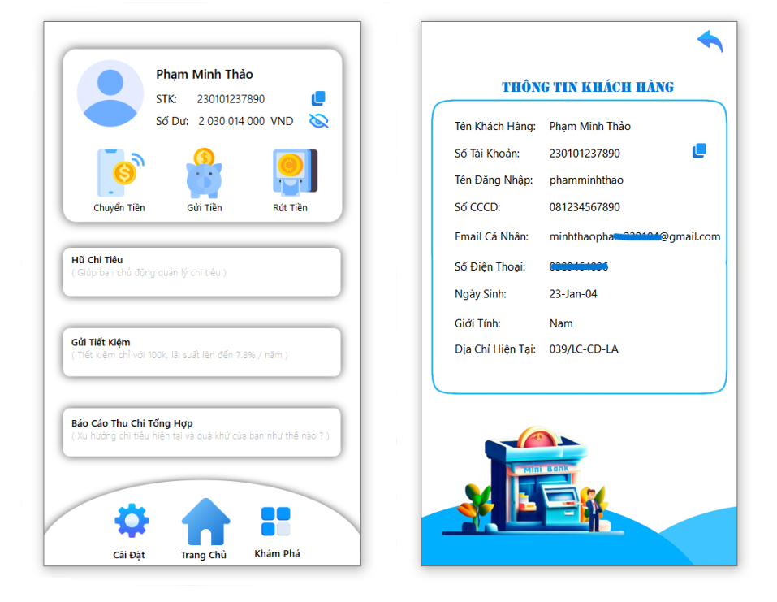

# Mini Banking Solution by Pham Minh Thao (version 1 - 2022)

## Introduction

MINI_BANKING is a project designed to simulate basic banking operations. Developed using C#, this project aims to provide a simple yet functional banking system that includes features such as account management, transactions, and security.

**Watch the Version 2 MTPE_BANK Introduction Video:**

[](https://www.youtube.com/watch?v=3zBvXEDJb-w)

## Features

- User account management
- Money transfer transactions
- Transaction history viewing
- User information security

## Installation

1. **Fork the repository**:
   - Navigate to [MINI_BANKING on GitHub](https://github.com/Trunks-Pham/MINI_BANKING) and click the "Fork" button in the upper right corner to create a copy of this repository in your GitHub account.

2. **Clone the repository**:
   ```bash
   git clone https://github.com/Trunks-Pham/MINI_BANKING.git
   ```

3. **Open the project**:
   - Open the project in Visual Studio by double-clicking the `MiniBanking.sln` file.

4. **Build the project**:
   - In Visual Studio, build the project by selecting `Build` > `Build Solution`.

5. **Run the project**:
   - After building, run the project by selecting `Debug` > `Start Debugging`.

## Impressive Display

Below are key visuals of the MINI_BANKING project:
- **Registration Screen**:
  
- **Home and Information Page**:
  

## Usage

- Access the application through the interface provided by Visual Studio.
- Register a new account or log in with an existing account.
- Perform banking functions such as transferring money, viewing transaction history, etc.


## Contributing

We welcome contributions from the community. Please fork this repository and submit a pull request with new features or bug fixes. All contributions will be thoroughly reviewed.
